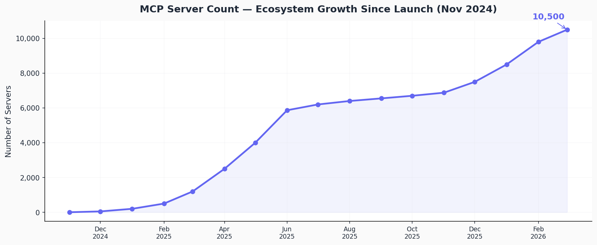
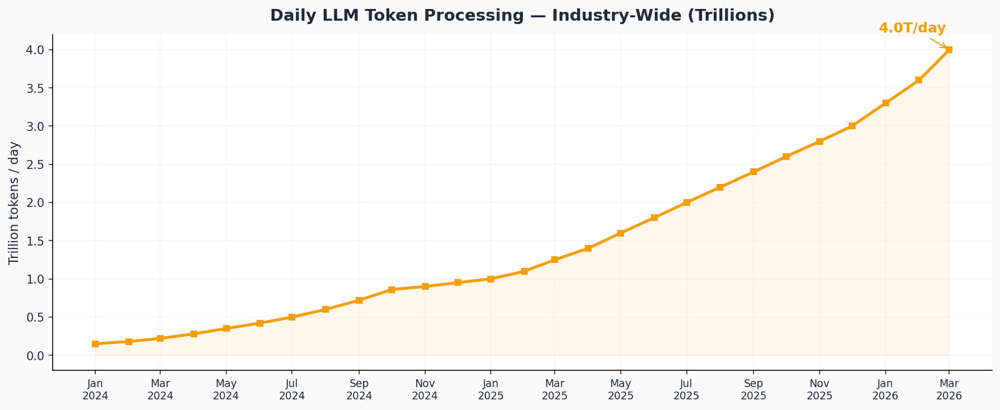
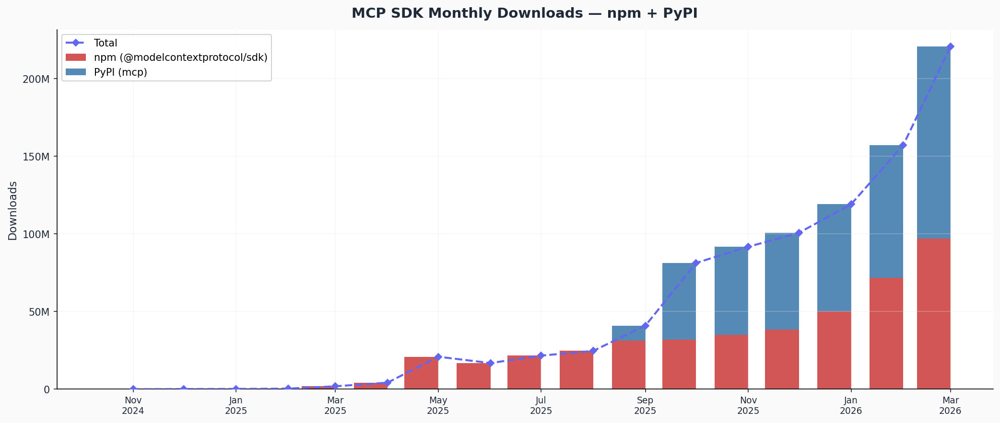

# MCP Ecosystem — Time Series Analysis

Time series visualizations tracking three key metrics of the Model Context Protocol (MCP) ecosystem:

1. **MCP Server Count** — Growth from Anthropic's launch (Nov 2024) to 10,000+ public servers
2. **LLM Token Usage** — Daily industry-wide token processing (trillions/day)
3. **MCP SDK Downloads** — Monthly downloads for the TypeScript (`@modelcontextprotocol/sdk` on npm) and Python (`mcp` on PyPI) SDKs

## Charts

### MCP Server Count


### Daily LLM Token Processing


### MCP SDK Monthly Downloads


An **interactive Plotly dashboard** with all three panels is available at [`charts/mcp_dashboard.html`](charts/mcp_dashboard.html).

## Data Sources

| Metric | Sources |
|--------|---------|
| MCP Server Count | [Glama directory](https://glama.ai/mcp/servers), [DreamFactory](https://www.dreamfactory.com/hub/mcp-server-statistics), [Pulse MCP](https://www.pulsemcp.com), [Bloomberry](https://bloomberry.com/blog/we-analyzed-1400-mcp-servers-heres-what-we-learned/), [Anthropic announcements](https://www.anthropic.com) |
| LLM Token Usage | [OpenRouter / a16z State of AI](https://openrouter.helicone.ai/state-of-ai) (100T token study), [NavyaAI](https://www.navyaai.com/reports/ai-cost-report-token-prices-vs-ai-bill) |
| SDK Downloads (npm) | [npm registry API](https://api.npmjs.org/downloads/range/) — `@modelcontextprotocol/sdk` daily download counts |
| SDK Downloads (PyPI) | [PyPI Stats API](https://pypistats.org/api/packages/mcp/overall) — `mcp` package daily download counts |

## Key Findings

- **3,500x SDK growth in 17 months**: npm downloads went from ~14K (Nov 2024) to ~97M (Mar 2026)
- **Server count hit 10,500+** by Mar 2026, up from 3 at launch
- **Token processing scaled ~27x** across the industry, from ~0.15T/day (Jan 2024) to ~4T/day (Mar 2026)
- SDK downloads accelerated sharply in May 2025 (npm) and the Python SDK joined in Sep 2025, with combined monthly downloads reaching 220M+ by Mar 2026

## Project Structure

```
├── data/
│   ├── mcp_server_count.csv       # Monthly server counts with sources
│   ├── llm_token_usage.csv        # Monthly token processing estimates
│   ├── mcp_sdk_downloads.csv      # Aggregated monthly SDK downloads
│   └── build_sdk_downloads.py     # Aggregates raw daily API data into monthly CSV
├── charts/
│   ├── mcp_dashboard.html         # Interactive Plotly dashboard (all 3 panels)
│   ├── mcp_server_count.png       # Static chart
│   ├── llm_token_usage.png        # Static chart
│   └── mcp_sdk_downloads.png      # Static chart
├── generate_charts.py             # Main script — generates all visualizations
├── requirements.txt               # Python dependencies
└── README.md
```

## Usage

```bash
pip install -r requirements.txt
python generate_charts.py
```

This regenerates all charts in `charts/`. The interactive dashboard can be opened directly in any browser.
