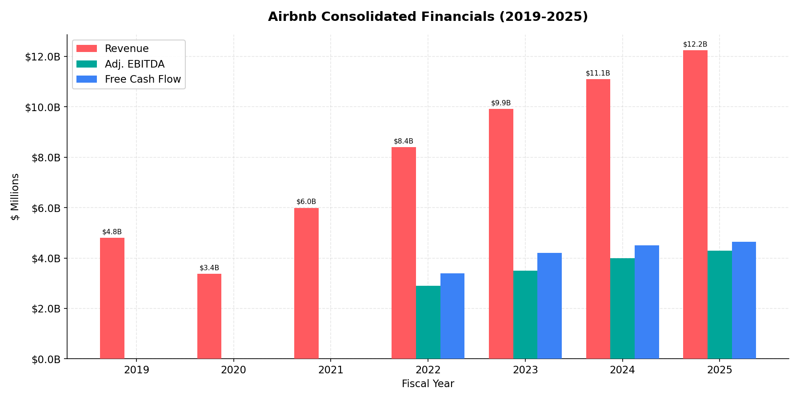
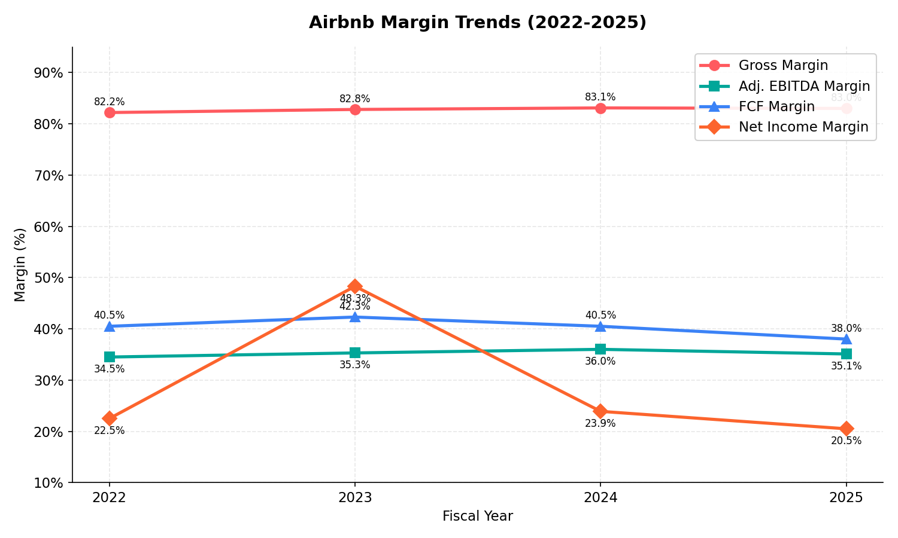
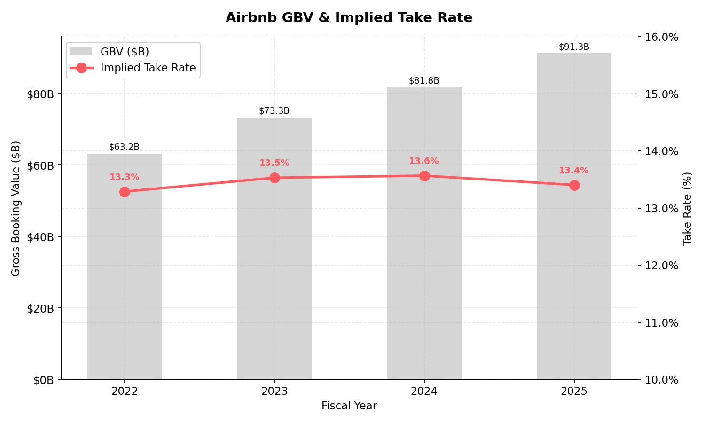
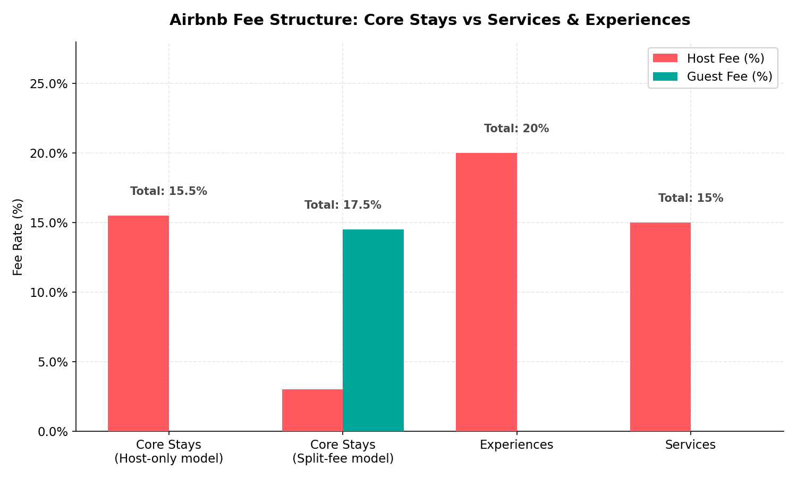
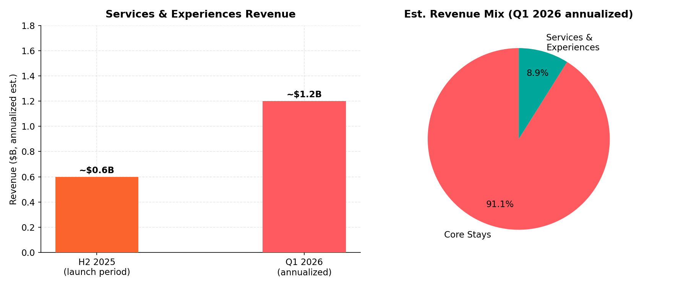
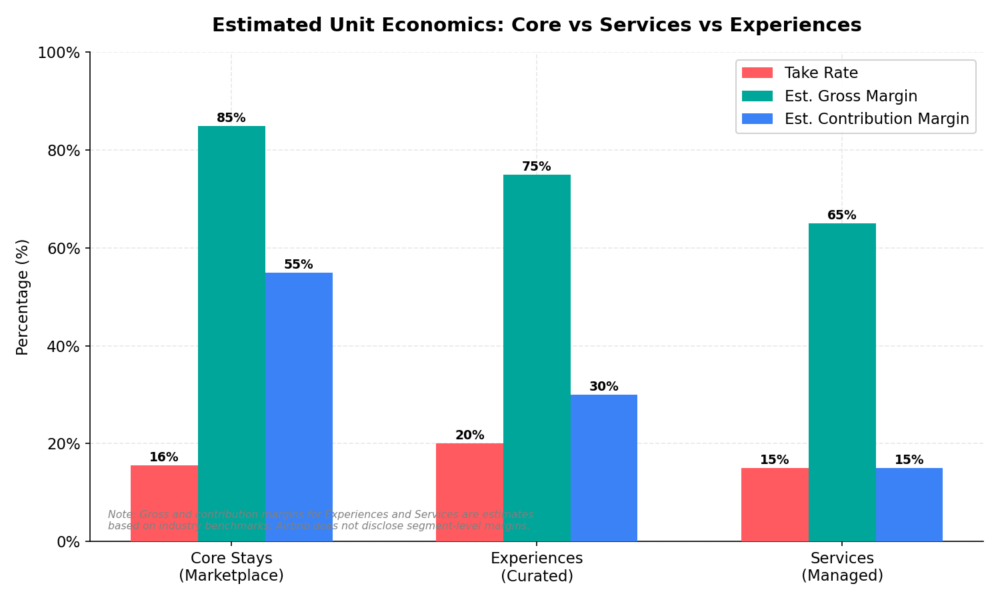
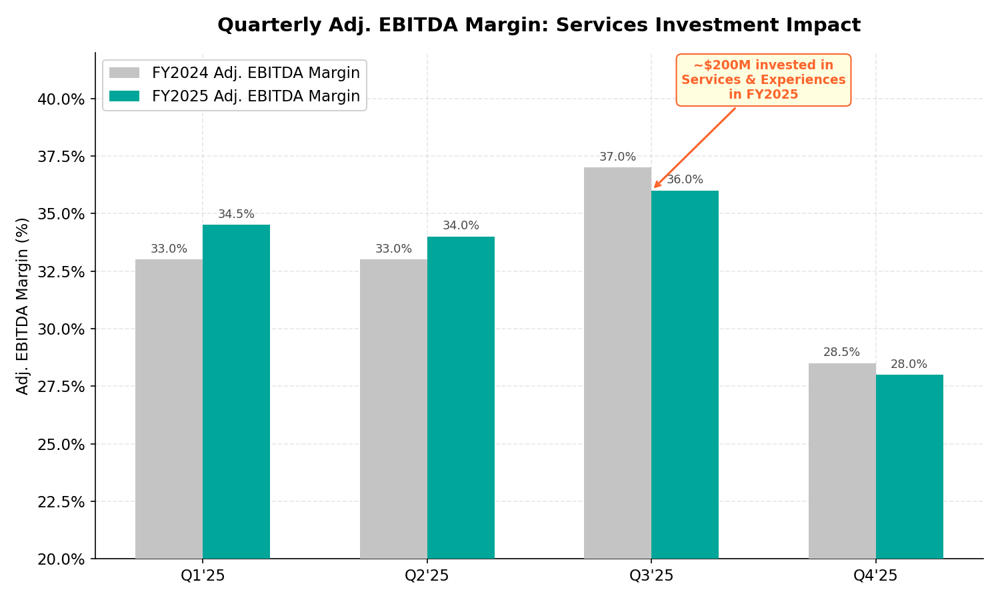
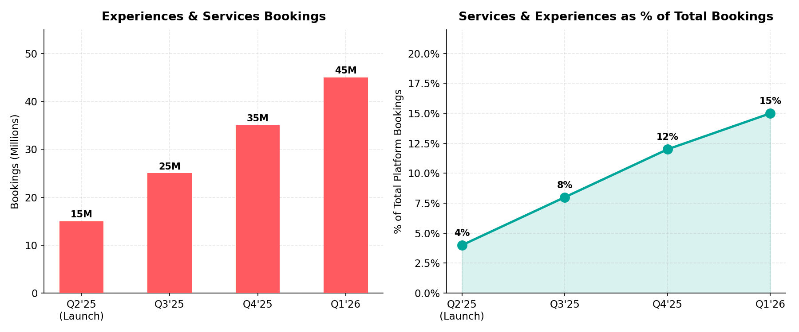
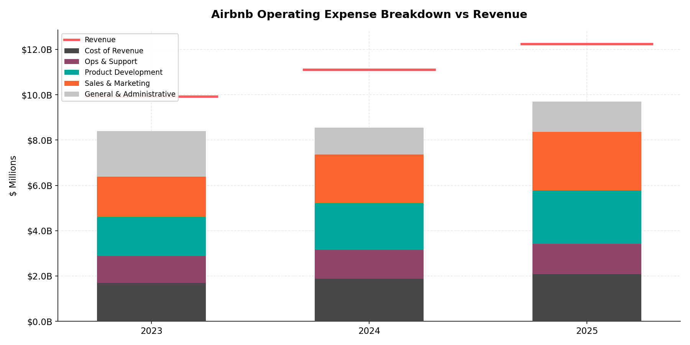
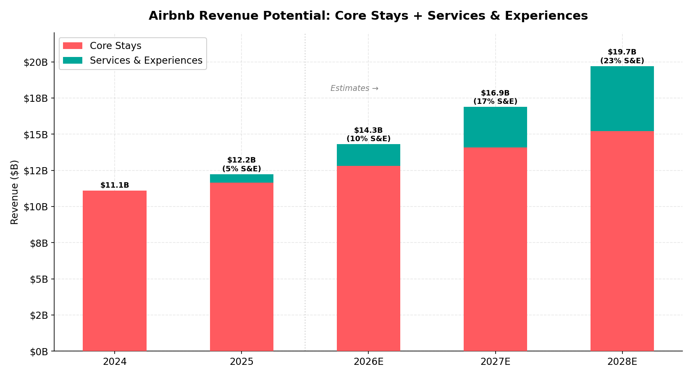

# Airbnb (ABNB) — Services Revenue & Margins Analysis

## Core Stays vs. New Services & Experiences Business

*Analysis as of Q1 2026 | Data through FY2025 actuals + Q1 2026 early indicators*

---

## Executive Summary

Airbnb launched **Airbnb Services** and reimagined **Airbnb Experiences** in May 2025 as part of its largest product release to date. These new verticals expand the company beyond accommodation stays into curated local activities and on-demand services (private chefs, personal trainers, massage therapists, etc.). While early-stage, the businesses are scaling rapidly — reaching **~$1.2B in annualized revenue** by Q1 2026 and accounting for **15% of total platform bookings**. The company invested approximately **$200M in FY2025** to launch and scale these offerings, compressing full-year Adj. EBITDA margin by ~100bps from 36% to 35%.

**Key finding:** Experiences carry a **higher take rate (20%)** than core stays (~15.5%), which should drive structurally better monetization over time, though contribution margins are currently negative as the company invests in supply acquisition, quality curation, and marketing. The core stays business remains highly profitable with ~83% gross margins and ~35% EBITDA margins.

---

## 1. Consolidated Financial Overview

| Metric | FY2022 | FY2023 | FY2024 | FY2025 |
|---|---|---|---|---|
| **Revenue** | $8.4B | $9.9B | $11.1B | $12.2B |
| **Revenue Growth** | 40.2% | 18.1% | 12.0% | 10.3% |
| **Adj. EBITDA** | $2.9B | $3.5B | $4.0B | $4.3B |
| **Net Income** | $1.9B | $4.8B | $2.6B | $2.5B |
| **Free Cash Flow** | $3.4B | $4.2B | $4.5B | $4.7B |
| **GBV** | $63.2B | $73.3B | $81.8B | $91.3B |

Airbnb has compounded revenue at a ~13% CAGR from 2022-2025 while maintaining best-in-class profitability for a marketplace business. FY2023 net income was elevated due to a one-time tax benefit.

---

## 2. Margin Profile

| Margin | FY2022 | FY2023 | FY2024 | FY2025 | Commentary |
|---|---|---|---|---|---|
| **Gross Margin** | 82.2% | 82.8% | 83.1% | 83.0% | Remarkably stable ~83% |
| **Adj. EBITDA Margin** | 34.5% | 35.3% | 36.0% | 35.1% | -90bps Y/Y from Services investment |
| **FCF Margin** | 40.5% | 42.3% | 40.5% | 38.0% | Still strong; asset-light model |
| **Net Income Margin** | 22.5% | 48.3%* | 23.9% | 20.5% | Declining ex-2023 tax item |

*FY2023 net income included a significant tax benefit.

The ~100bps EBITDA margin decline in FY2025 is directly attributable to the ~$200M investment in Services & Experiences. Management guided for stable margins in FY2026 despite continued investment, implying operating leverage in the core business is funding new initiatives.

---

## 3. Take Rate & GBV

Airbnb's implied take rate (Revenue / GBV) has been stable at ~13.3-13.5%. The Q2 2025 take rate ticked up to 13.2% from 13.0% in Q2 2024, aided by cross-currency booking fees introduced mid-2024 and paid guest travel insurance expansion.

Management guided for "slightly higher" take rate in Q1 2026, which could reflect increasing mix of higher-take-rate Experiences (20% vs ~15.5% for stays).

---

## 4. Services & Experiences vs. Core Business

### 4a. Fee Structure Comparison

| Business Line | Host Fee | Guest Fee | Total Take Rate | Notes |
|---|---|---|---|---|
| **Core Stays (host-only)** | 15.5% | 0% | ~15.5% | New model (late 2025) |
| **Core Stays (split-fee)** | ~3% | 14-16% | ~17.5% | Legacy model, still used in some markets |
| **Experiences** | **20%** | 0% | **20%** | 450bps premium vs stays |
| **Services** | ~15% | $6 min | ~15%+ | Lower base rate but minimum fee lifts effective rate on small bookings |

**Key insight:** Experiences carry a **450bps higher take rate** than core stays under the host-only model. As Experiences scale, this should be incrementally positive for the blended take rate. Services have a lower nominal rate but the $6 minimum fee means effective take rates on lower-priced services (yoga class, guided tour) can be meaningfully higher.

### 4b. Revenue Trajectory

| Metric | H2 2025 | Q1 2026 (annualized) |
|---|---|---|
| **Est. Services & Experiences Revenue** | ~$0.6B (run rate) | **~$1.2B** |
| **% of Total Revenue** | ~5% | **~8-9%** |
| **Bookings (quarterly)** | 35M (Q4'25) | 45M (Q1'26) |
| **% of Total Bookings** | 12% (Q4'25) | **15%** (Q1'26) |

The Services & Experiences business has scaled from zero to ~$1.2B annualized revenue in under a year — an impressive ramp. By Q1 2026, bookings grew **28% Q/Q** to 45 million, with the segment now representing 15% of all platform bookings.

Notably, **~50% of Experiences bookings in Q4 2025 were standalone** (not attached to a stay), indicating strong independent demand and suggesting the TAM extends beyond just enhancing existing stays.

### 4c. Unit Economics (Estimated)

| Metric | Core Stays | Experiences | Services |
|---|---|---|---|
| **Take Rate** | ~15.5% | ~20% | ~15% |
| **Est. Gross Margin** | ~85% | ~75% | ~65% |
| **Est. Contribution Margin** | ~55% | ~30% (at scale) | ~15% (early stage) |
| **Supply Quality Control** | Rating-based | Curated/vetted | Vetted with partners |
| **CAC** | Low (organic + brand) | Higher (curation cost) | Higher (partner onboarding) |

> **Note:** Airbnb does not disclose segment-level margins. Estimates above are based on industry benchmarks for managed marketplace models. Services contribution margins are expected to be lower initially due to higher quality curation costs and partner management overhead.

**Why Services margins are structurally lower than Stays:**
- **Higher curation costs:** Services require vetting individual providers (private chefs, trainers) vs. listing verification for stays
- **Lower AOV:** Average order value for a yoga session or chef booking is materially lower than a multi-night stay, meaning fixed costs per transaction eat more margin
- **Operational intensity:** Services involve real-time scheduling, provider quality management, and more complex customer support
- **Partner management:** Services pilot includes third-party partnerships (e.g., grocery delivery) that require revenue sharing

**Why Experiences should converge toward core margins over time:**
- 20% take rate provides a structural advantage
- Scale efficiencies as host supply grows (60,000+ applications within months of launch)
- Lower marginal cost per booking once supply is curated
- Cross-sell with stays reduces effective CAC

---

## 5. Impact on Margins

### FY2025 Investment Impact
- **~$200M invested** in Services & Experiences (confirmed in Q2 2025 shareholder letter)
- This compressed full-year Adj. EBITDA margin from an estimated ~36% to **35.1%**
- The investment spans: supply acquisition, app redesign, quality curation, local marketing, and partner onboarding

### FY2026 Outlook
- Management guided for **stable Adj. EBITDA margins** Y/Y despite continued reinvestment
- Revenue growth expected to **accelerate to "at least low double-digits"**
- Implies core business operating leverage is funding Services investment at margin neutrality
- Q1 2026 EBITDA margin guided **"approximately flat"** Y/Y

### Path to Profitability for Services
The services business is in an investment phase, but several factors suggest a path to positive contribution margins by FY2027-2028:
1. **Scale economies:** Per-transaction costs decline as booking volume grows
2. **Supply flywheel:** 60K+ host applications suggest organic supply growth is building
3. **Cross-sell leverage:** Bundling with stays reduces standalone marketing costs
4. **Take rate advantage:** 20% Experiences take rate provides margin headroom
5. **AI-powered operations:** AI customer service (resolving ~33% of issues without agents) will disproportionately benefit Services' more complex support needs

---

## 6. Growth Metrics

| KPI | Q2 2025 | Q3 2025 | Q4 2025 | Q1 2026 |
|---|---|---|---|---|
| **Bookings (M)** | ~15M | ~25M | ~35M | **45M** |
| **% of Platform Bookings** | ~4% | ~8% | ~12% | **15%** |
| **Y/Y Booking Growth** | — | — | — | **+28%** |
| **Guest Rating** | 4.93/5 | 4.93/5 | 4.93/5 | — |
| **Standalone (non-stay attached)** | — | — | ~50% | — |

The quality signal is strong — **4.93 out of 5.0 stars** exceeds core stays ratings, suggesting the curation strategy is working and should drive repeat usage and word-of-mouth growth.

---

## 7. Operating Expense Structure

| Expense Category | FY2023 | FY2024 | FY2025 | Y/Y Δ (FY25) |
|---|---|---|---|---|
| **Cost of Revenue** | $1,702M (17.2%) | $1,878M (16.9%) | $2,086M (17.0%) | +11% |
| **Ops & Support** | $1,186M (12.0%) | $1,282M (11.6%) | $1,327M (10.8%) | +4% |
| **Product Development** | $1,722M (17.4%) | $2,056M (18.5%) | $2,354M (19.2%) | +14% |
| **Sales & Marketing** | $1,763M (17.8%) | $2,148M (19.4%) | $2,588M (21.1%) | +20% |
| **G&A** | $2,025M (20.4%) | $1,184M (10.7%) | $1,342M (11.0%) | +13% |

Key observations:
- **Sales & Marketing (+20% Y/Y)** is the fastest-growing line, reflecting investment in global expansion and Services awareness
- **Product Development (+14%)** reflects the app redesign and AI integration
- **Ops & Support (+4%)** growing below revenue, showing operational leverage from AI-powered customer service
- The Services/Experiences investment is spread across Product Development (app redesign, new tools), Sales & Marketing (launch campaigns, local marketing), and Ops & Support (quality curation)

---

## 8. Strategic Revenue Potential

### Bull Case Revenue Build (2024-2028E)

| | FY2024 | FY2025 | FY2026E | FY2027E | FY2028E |
|---|---|---|---|---|---|
| **Core Stays** | $11.1B | $11.6B | $12.8B | $14.1B | $15.2B |
| **Services & Experiences** | — | $0.6B | $1.5B | $2.8B | $4.5B |
| **Total Revenue** | $11.1B | $12.2B | $14.3B | $16.9B | $19.7B |
| **S&E % of Total** | 0% | 5% | 10% | 17% | 23% |

### Key Assumptions
- Core stays grows at 8-10% annually (nights growth + modest ADR increases)
- Services & Experiences scales aggressively: 150% Y/Y in FY2026, ~87% in FY2027, ~61% in FY2028
- By FY2028, Services & Experiences could represent ~23% of total revenue
- Total revenue CAGR 2025-2028E: ~17% (vs ~10% for core alone)

### Margin Implications of Revenue Mix Shift

| Scenario | EBITDA Margin | Commentary |
|---|---|---|
| **Core Only (no S&E)** | ~37-38% | Natural margin expansion from operating leverage |
| **Blended (with S&E investment)** | ~35-36% | Near-term margin drag from S&E investment |
| **Blended (S&E at scale, 2028E)** | ~36-38% | S&E contribution margins improve as scale is achieved |

The bull case thesis is that Services & Experiences **accelerates the revenue growth rate from ~10% to ~17%** while maintaining margins in the mid-30s, significantly improving the revenue trajectory and justifying a higher multiple.

---

## 9. Competitive Context

| Competitor | Core Business | Adjacent Services | Take Rate |
|---|---|---|---|
| **Airbnb** | Accommodation marketplace | Experiences, Services, Hotel pilot | 15.5-20% |
| **Booking Holdings** | Hotels + vacation rentals | Attractions, restaurant bookings, car rental | ~15-16% |
| **Expedia** | Hotels + vacation rentals | Activities via Viator (owned) | ~12-14% |
| **GetYourGuide** | Activities & experiences | — (pure-play) | ~25-30% |
| **Marriott Bonvoy** | Hotel chain | Tours & activities | Internal margin |

Airbnb's competitive advantage in Services/Experiences lies in its **existing demand-side scale** (2B+ guest arrivals to date) and the **trust/community** dynamics of its host model. The 4.93-star rating suggests the curated quality approach is differentiating vs. aggregator models.

---

## 10. Key Risks

| Risk | Severity | Mitigation |
|---|---|---|
| **Services margin dilution** | Medium | Guided stable margins in FY2026; core leverage funds investment |
| **Quality at scale** | Medium | High curation bar (4.93 rating); vetting process |
| **Regulatory risk** | Medium | Service provider classification / labor laws in key markets |
| **Cannibalization of take rate** | Low | Services actually has higher take rate (Experiences at 20%) |
| **Management distraction** | Low | Separate teams; $200M is <2% of revenue |
| **Competition from Viator/GYG** | Medium | Existing demand + booking intent is a moat |

---

## Methodology & Sources

- Financial data from Airbnb SEC filings (10-K, 10-Q), shareholder letters, and earnings releases
- Revenue and margin figures are GAAP unless noted as "Adjusted"
- Services & Experiences estimates are derived from disclosed bookings data, take rates, and management commentary
- Forward estimates (2026E-2028E) are illustrative scenarios, not consensus
- All charts generated via `airbnb_services_revenue_margins.py`

*Sources: Airbnb 10-K (FY2024, FY2025), Q2/Q3/Q4 2025 Shareholder Letters, Q4 FY2025 Earnings Call Transcript, Q1 2026 reported metrics*
