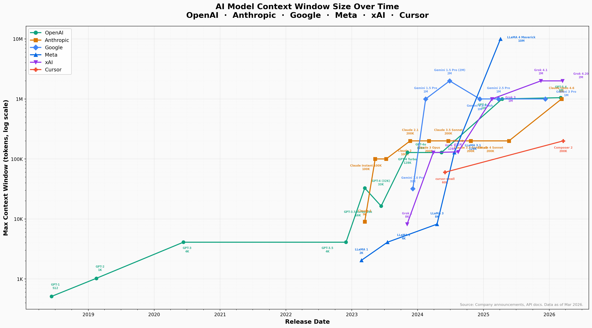
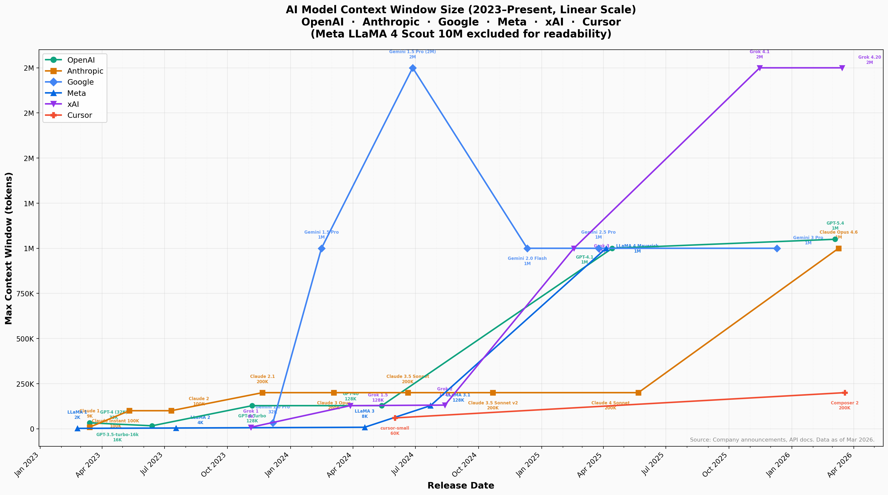

# Equity-research

## AI Model Context Window (Token Count) Time Series

Tracks the evolution of maximum context window sizes across major AI model providers:

| Company | Models Tracked | Latest Max Context |
|---------|----------------|-------------------|
| **OpenAI** | GPT-1 → GPT-5.4 | 1.05M tokens |
| **Anthropic** | Claude 1 → Claude Opus 4.6 | 1M tokens |
| **Google** | Gemini 1.0 → Gemini 3 Pro | 2M tokens |
| **Meta** | LLaMA 1 → LLaMA 4 Scout | 10M tokens |
| **xAI** | Grok 1 → Grok 4.20 | 2M tokens |
| **Cursor** | cursor-small → Composer 2 | 200K tokens |

### Charts

#### Log Scale (Full History, 2018–2026)



#### Linear Scale (2023–Present)



## Monthly Total Token Volume (Training vs Inference)

Excel workbook with monthly token counts across all six companies, split by training and inference:

[`data/token_volume_monthly.xlsx`](data/token_volume_monthly.xlsx)

**Sheets:**
1. **Monthly Token Volume** — Combined view: every company × every month, training + inference + total
2. **OpenAI / Anthropic / Google / Meta / xAI / Cursor** — Per-company breakdowns with embedded charts
3. **Training Runs** — Reference table of all model training runs with token counts and sources
4. **Methodology** — Data sources, estimation approach, and caveats

### Data

- Context windows: [`data/token_context_windows.csv`](data/token_context_windows.csv)
- Token volumes: [`data/token_volume_monthly.xlsx`](data/token_volume_monthly.xlsx)

### Regenerating

```bash
pip install pandas matplotlib openpyxl
python3 scripts/plot_token_context_windows.py
python3 scripts/generate_token_volume_excel.py
```
